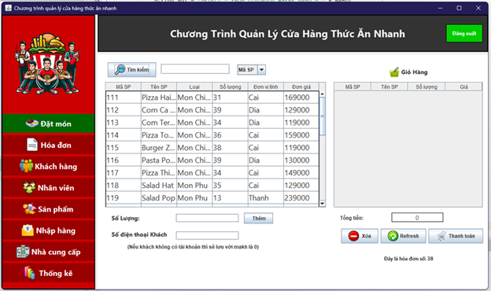
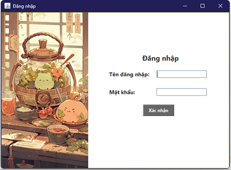
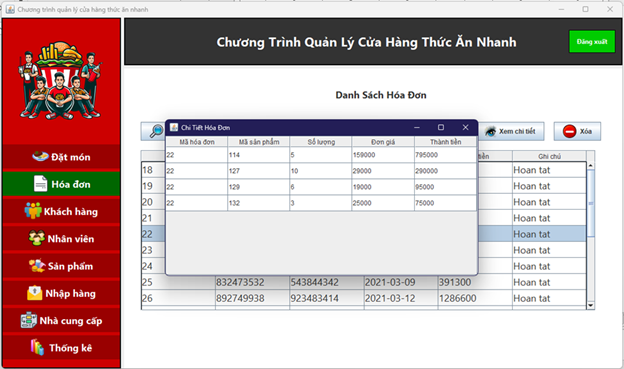
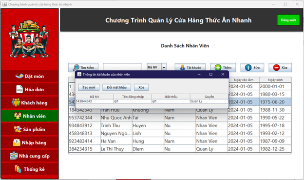
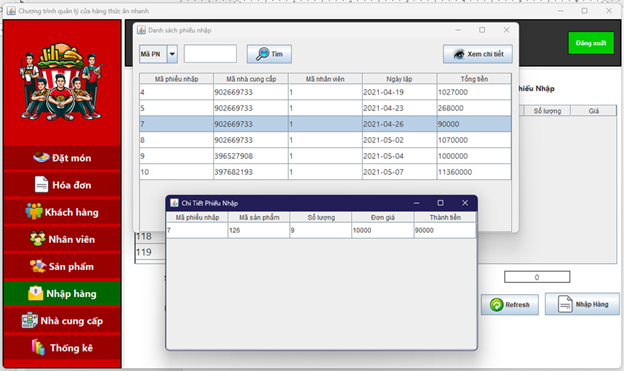

<h1 align="center">
   
  
   
  QSR MANAGER APP
   
</h1>

<h4 align="center">Ứng dụng quản lý cửa hàng thức ăn nhanh</h4>

  
  

  
  
  
  

  
  

## Cài đặt
* Apache NetBeans 21, Eclipse 2024-03R
* Oracle Database 19c.
* JDK 22 và thêm các file thư viện jcommon-1.0.23, jfreechart-1.0.19, jfreechart-1.0.19-experimental, jfreechart-1.0.19-swt, ojdbc11. 

## Một số ảnh của ứng dụng
### Trang đăng nhập

  
  

### Trang đặt món

  
  

### Quản lý hóa đơn

  
  

### Quản lý khách hàng

  
  

### Quản lý sản phẩm

  
  

### Trang nhập hàng

  
  

### Trang thống kê doanh thu

  
  

