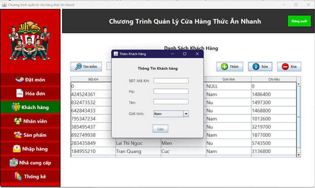
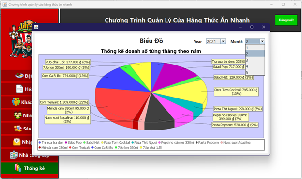

<h1 align="center">
   
  
   
  QSR MANAGER APP
   
</h1>

<h4 align="center">Ứng dụng quản lý cửa hàng thức ăn nhanh</h4>

  
  

  
  
  
  

  <a href="#key-features">Key Features</a> •
  <a href="#how-to-use">How To Use</a> •
  <a href="#download">Download</a> •
  <a href="#credits">Credits</a> •
  <a href="#related">Related</a> •
  <a href="#license">License</a>

  
  

## Key Features

* LivePreview - Make changes, See changes
  - Instantly see what your Markdown documents look like in HTML as you create them.
* Sync Scrolling
  - While you type, LivePreview will automatically scroll to the current location you're editing.
* GitHub Flavored Markdown  
* Syntax highlighting
* [KaTeX](https://khan.github.io/KaTeX/) Support
* Dark/Light mode
* Toolbar for basic Markdown formatting
* Supports multiple cursors
* Save the Markdown preview as PDF
* Emoji support in preview :tada:
* App will keep alive in tray for quick usage
* Full screen mode
  - Write distraction free.
* Cross platform
  - Windows, macOS and Linux ready.

## Một số ảnh của ứng dụng
### Trang đăng nhập

  
  

### Trang đặt món

  
  

### Quản lý hóa đơn

  
  

### Giao diện đăng nhập

  
  

### Giao diện đăng nhập

  
  

### Giao diện đăng nhập

  
  

### Giao diện đăng nhập

  
  

## Download

You can [download](https://github.com/amitmerchant1990/electron-markdownify/releases/tag/v1.2.0) the latest installable version of Markdownify for Windows, macOS and Linux.

## Emailware

Markdownify is an [emailware](https://en.wiktionary.org/wiki/emailware). Meaning, if you liked using this app or it has helped you in any way, I'd like you send me an email at <bullredeyes@gmail.com> about anything you'd want to say about this software. I'd really appreciate it!
